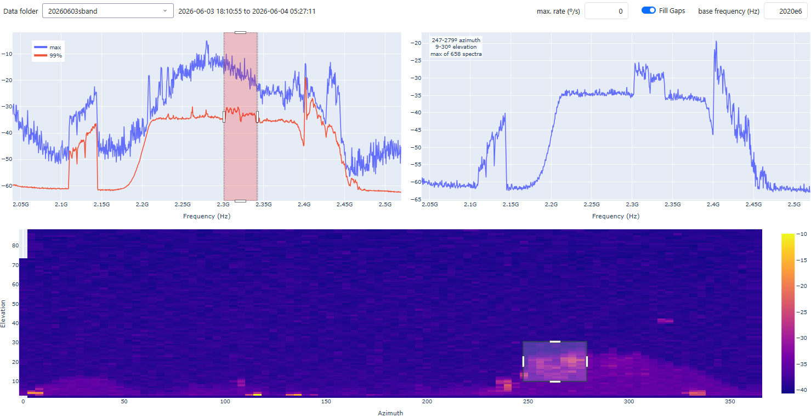
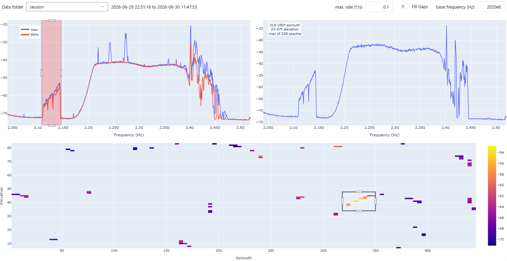

FSRFIscanner
------------

FSRFIscanner is a collection of Python scripts that enables a Field
System–controlled radio telescope to be used as a RFI (Radio Frequency Interference)
scanner.

`antenna_control.py`, running on the Field System computer, continuously
records the antenna pointing position along with a UTC timestamp and
stores the data in an HDF5 file.

`analyzer.py` can be run on any computer with remote access to a
spectrum analyzer. It continuously acquires the current
spectrum trace, timestamps it in UTC, and stores the data in an HDF5
file.

`vis.py` combines the antenna pointing and spectrum datasets by matching
their timestamps, reduces the data through binning, and
generates spectral intensity maps. It provides interactive tools for
exploring the data, allowing the user to filter by frequency range,
azimuth/elevation coordinates, or both.

The latter two scripts run on both linux and windows, while the first script
has to run on the Field System linux computer.

Technical prerequisites
-----------------------

The antenna control code relies on the following snap commands:

    antenna=PRES,az,el
    antenna=SLEW,azspeed,elspeed
    antenna=ACTI
    antenna=STAN

if your antenna control uses other commands, you will need to modify `antenna_control.py`
or implement a subclass of `antenna_control.Antenna` that
provides the required command mappings.

Communication with the spectrum analyzer is performed using SCPI commands sent
via VISA. Most modern spectrum analyzers support this interface. If your
instrument uses a different communication protocol, you will need to adapt the
implementation or create a subclass of `analyzer.Analyzer` that implements the
appropriate communication methods.

Installation
------------

The software has been tested with python3 (>3.7) but it should be possible to
run at least `antenna_control.py` with python2. Please ask me if you need help. 
The required python packages can easily be installed via `pip`. 

Create a virtual python environment

    python -m venv .venv

In case a `command not found` error is reported, try again with `python3` instead.
Activate the new python environment:

    . .venv/bin/activate

and install the dependencies with:

    python -m pip install -r requirements_xxxx.txt

Since the three scripts are typically executed on different computers and have different
dependencies, a separate `requirements_xxx.txt` file is provided for each script. Install the
dependencies using the requirements file corresponding to the script you intend to run.

To read the antenna position from the Field System shared memory, the software must
know which station-code variables contain the azimuth and elevation values and where
these variables are located within the shared memory structure.

The script `stcom.py` assists with this task. Under the hood it calls a C compiler
which is usually installed by default on a field system computer. It looks for `stcom.h` either in its
standard location (`/usr2/st/include`) or in the current working directory. When
executed successfully, it generates a `.env` file containing the shared-memory
offsets of the relevant azimuth and elevation variables. You need to provide the variable
names as command line argument, e.g.

    python stcom.py Azactpos Elactpos [Azactrate] [Elactrate]

Adapt the variable names according to your `stcom.h`. "Azactrate" and "Elactrate" are optional. When present,
the slewing rates will be recorded along with the position. In the visualizaton app the data can be
filtered by a maximum slewing rate. This is useful, when a VLBI session is monitored, to exclude data
points when the antenna was slewing rather than tracking.
 
These offsets are subsequently used by antenna_control.py to access the antenna
position data directly from shared memory.

Using the antenna control
-------------------------

`antenna_control.py` is executed from the command line. Before running it,
a configuration file describing the desired scan pattern must be created.

The configuration file uses the following format.

The first line specifies the initial antenna position as a comma-separated
azimuth/elevation pair:

    az_init,el_init

Each subsequent line defines a relative antenna movement and the
corresponding slew rate:

    axis,offset,speed

where:

- `axis` is either `az` (azimuth) or `el` (elevation),
- `offset` is the relative movement in degrees (positive or negative),
- `speed` is the absolute slew rate in degrees per second.

For example,

    az,-40,0.4

moves the antenna by −40° in azimuth at a slew rate of 0.4°/s.

Similarly,

    el,1,0.1

moves the antenna by +1° in elevation at a slew rate of 0.1°/s.

The commands are executed sequentially in the order in which they appear
in the configuration file, thereby defining the complete scanning
pattern. The `gensky.py` script demonstrates how to generate a full sky scan
starting at 0,2 az/el position. It creates a config file 'fullsky.cnf'.

Start the scan in simulation mode (no commands are sent to the anntena) by executing

    python antenna_control.py fullsky.cnf

Once you are sure everything is alright, start the real scan with

    python antenna_control.py fullsky.cnf --nosim

When no config file is provided, only the position acquisition loop will run. This can be used
to record the antenna position in parallel to a running observation program.

The data is stored to a hdf5 file in the current directory with the naming pattern "\<datetime\>_\<config file\>.h5"
or just "\<datetime\>.h5" in case no config file was provided.

Using the analyzer interface
----------------------------

The `analyzer.py` script requires two command-line arguments: a configuration file and the VISA address of the
spectrum analyzer. For example:

    python analyzer.py sband.cnf TCPIP0::10.10.10.152::INSTR

You may provide an output file name as third parameter. If absent, the output file will be named "\<datetime\>_\<config file\>.h5".

Example configuration file (sband.cnf):

    START_FREQ=20e6
    STOP_FREQ=500e6
    POINTS=1001
    RBW=1e6
    MAXHOLD=2

The configuration consists of `parameter=value` pairs. The following parameters are supported:

- PTS - number of points of the trace
- RBW - resolution bandwidth (Hz)
- START_FREQ - start frequency (Hz)
- STOP_FREQ - stop frequency (Hz)
- CENTER - center frequency (Hz)
- SPAN - frequency span (Hz)
- LEVEL - reference level (dB)
- MAXHOLD - maxhold time (s)

Any subset of these parameters may be specified, and the configuration file may even be empty.
Parameters that are omitted will retain their current values on the instrument, allowing the
existing analyzer configuration to be used unchanged.

Run an experiment
-----------------

Start both scripts at roughly the same time to generate the position and spectra datasets. When the scan
finishes, stop the analyzer script with CTRL-C.

Visualization
-------------

Create a `data` folder in the program directory and, inside it, create one subdirectory for each
experiment. The experiment directories may have any name. Copy both HDF5 files produced by an
experiment into the corresponding directory.

The visualization software automatically identifies the position file and the spectra file based on
their file sizes. In most cases, the spectra file is significantly larger than the position file.

Run the `vis.py` script. The user interface is served through a web browser. After the script starts,
it prints the URL of the web application to the terminal. Open this URL in your browser to access the interface.

     * Serving Flask app 'vis'
     * Debug mode: off
    WARNING: This is a development server. Do not use it in a production deployment. Use a production WSGI server instead.
     * Running on http://127.0.0.1:8050
    Press CTRL+C to quit

The user interface consists of three linked plots:

- Top left: Displays the maximum spectrum over the entire dataset together with its 99th percentile.
- Bottom: Displays an intensity map showing the maximum signal intensity for each azimuth/elevation bin.
- Top right: Displays the maximum spectrum corresponding to the currently selected azimuth/elevation
region.

The plots are interactive:

1. Selecting a frequency range in the top-left spectrum plot updates the intensity map to show only 
   data within the selected frequency interval.
2. Selecting an azimuth/elevation region in the intensity map updates the top-right spectrum plot
   to display the maximum spectrum for the selected area.

This allows you to quickly identify interference sources in both frequency and sky position and to
examine their spectral characteristics in detail.

In case the recorded spectra have been frequency converted, you may enter the LO frequency in `base frequency`
to correct the frequency axes.

The `fill gaps` switch fills empty cells in the azimuth/elevation map by copying the value from the cell immediately to
the left. This is useful for programmed azimuth/elevation scans, where the combination of the selected maxhold time and
the antenna's slewing speed can leave some map cells without data. Filling these gaps results in a more continuous display.  

The `max. rate` input filters data based on the antenna's slewing rate. This is useful when displaying data from,
for example, a VLBI session, where you may wish to exclude points for which the antenna's angular rate exceeded a
specified threshold, effectively removing periods of slewing and retaining only normal tracking data.

a full sky scan in legacy S-band

a subset of observations of a R1 session